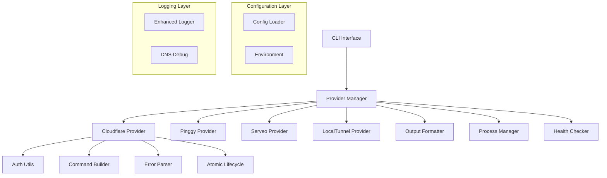
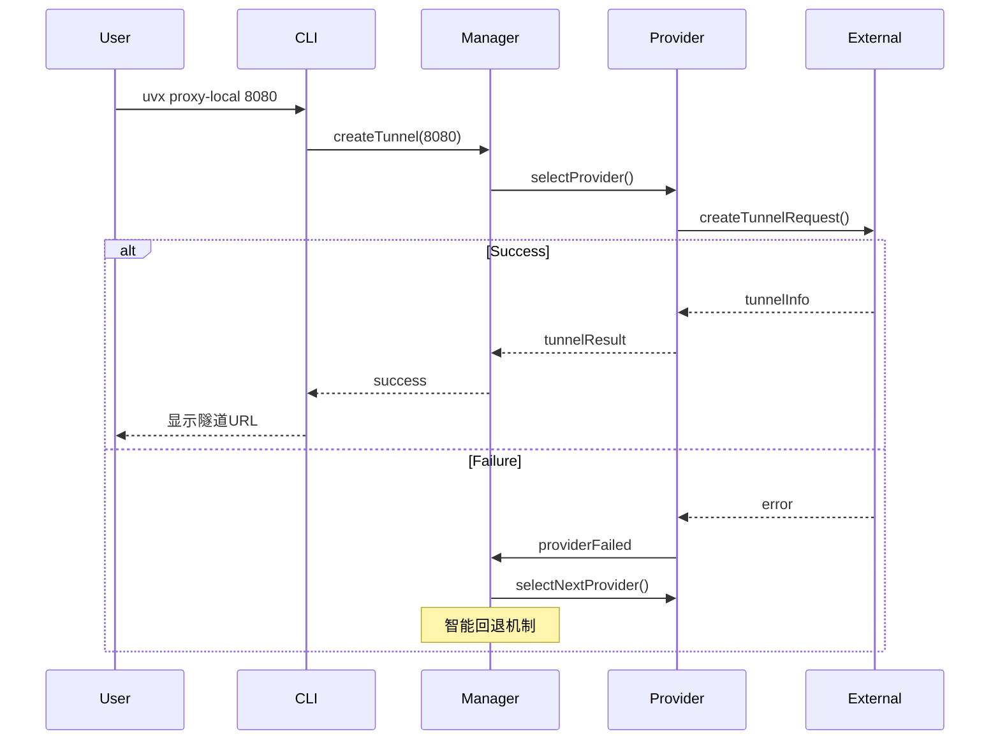
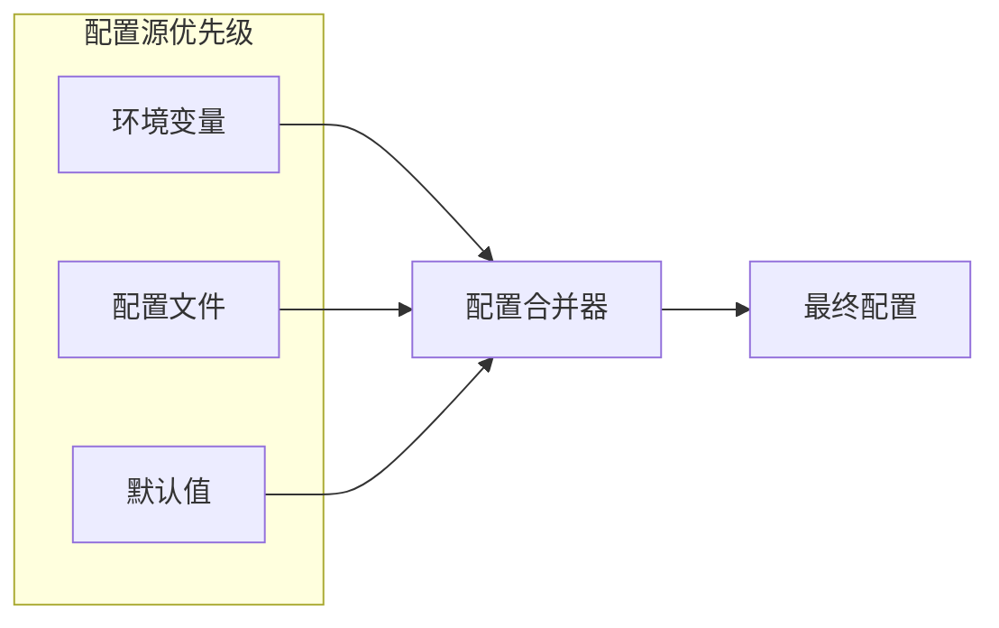

# 架构设计文档

## 📖 概述

uvx-proxy-local 是一个企业级多提供商内网穿透CLI工具，通过智能回退机制和原子化生命周期管理，提供稳定、可靠的隧道服务。

### 核心特性
- 🔄 **智能回退机制**: 自动切换到可用的隧道提供商
- 🏗️ **原子化操作**: 事务性隧道生命周期管理
- 🎯 **多提供商支持**: Cloudflare, Pinggy, Serveo, LocalTunnel
- 🛡️ **企业级稳定性**: 完整错误处理和自动恢复
- ⚡ **一键操作**: 简化的用户交互流程

## 🏗️ 系统架构

### 整体架构视图


### 分层架构设计
```
┌─────────────────────────────────────────┐
│           用户接口层 (UI Layer)            │
│  - CLI命令解析                             │
│  - 交互式界面                             │  
│  - 输出格式化                             │
├─────────────────────────────────────────┤
│          业务逻辑层 (Business Layer)       │
│  - 提供商管理器                           │
│  - 智能回退机制                           │
│  - 隧道生命周期管理                       │
├─────────────────────────────────────────┤
│         提供商实现层 (Provider Layer)      │
│  - Cloudflare Provider                   │
│  - Pinggy Provider                       │
│  - Serveo Provider                       │
│  - LocalTunnel Provider                  │
├─────────────────────────────────────────┤
│          工具支撑层 (Utility Layer)        │
│  - 配置管理                               │
│  - 进程管理                               │
│  - 错误处理                               │
│  - 日志记录                               │
└─────────────────────────────────────────┘
```

## 🎯 核心组件详解

### 1. 提供商管理器 (Provider Manager)
```javascript
class ProviderManager {
    constructor(providers, fallbackStrategy) {
        this.providers = providers;           // 按优先级排序的提供商列表
        this.fallbackStrategy = fallbackStrategy;
        this.currentProviderIndex = 0;
    }
    
    async createTunnelWithFallback(port, options) {
        // 智能回退逻辑实现
        for (let i = this.currentProviderIndex; i < this.providers.length; i++) {
            try {
                return await this.providers[i].createTunnel(port, options);
            } catch (error) {
                logger.warn(`提供商 ${i} 失败，尝试下一个`, error);
                continue;
            }
        }
        throw new Error('所有提供商均失败');
    }
}
```

**核心功能**:
- 智能提供商选择和优先级管理
- 自动失败转移和回退机制
- 提供商状态监控和健康检查
- 配置驱动的提供商启用/禁用

### 2. 原子化隧道生命周期管理
```javascript
class AtomicTunnelLifecycle {
    async executeAtomicOperation(operations) {
        const rollbackStack = [];
        
        try {
            for (const operation of operations) {
                const result = await operation.execute();
                rollbackStack.push({
                    operation: operation.rollback,
                    context: result
                });
            }
            return rollbackStack;
        } catch (error) {
            // 执行完整回滚
            await this.rollback(rollbackStack);
            throw error;
        }
    }
}
```

**核心功能**:
- 事务性隧道操作保证原子性
- 失败时完整回滚到初始状态
- 操作状态一致性验证
- 资源清理和状态恢复

### 3. Cloudflare提供商实现
```javascript
class CloudflareProvider extends TunnelProvider {
    async createTunnel(port, options = {}) {
        // 1. 环境预检和认证状态检查
        await this.validateEnvironment();
        
        // 2. 根据认证状态选择流程
        if (await this.isAuthenticated()) {
            return await this.handleAuthenticatedFlow(port, options);
        } else {
            return await this.handleUnauthenticatedFlow(port, options);
        }
    }
    
    async handleAuthenticatedFlow(port, options) {
        // 命名隧道创建流程
        const tunnel = await this.createNamedTunnel(options.subdomain);
        await this.configureDnsRouting(tunnel, options.subdomain);
        return await this.startTunnelProcess(tunnel, port);
    }
}
```

**核心功能**:
- 双路径支持：临时隧道 + 命名隧道
- 智能DNS配置和冲突处理  
- API令牌认证和凭证管理
- 三层DNS创建逻辑 (CLI → 冲突解决 → API回退)

### 4. 智能错误处理系统
```javascript
class CloudflaredErrorParser {
    static parseError(stderr, context = {}) {
        const errorPatterns = [
            {
                pattern: /certificate.*not found/i,
                code: 'AUTH_CERT_NOT_FOUND',
                message: '认证证书未找到，请先执行登录',
                solution: '运行 cloudflared tunnel login'
            },
            // ... 15种错误类型定义
        ];
        
        return this.matchErrorPattern(stderr, errorPatterns, context);
    }
}
```

**核心功能**:
- 15种错误类型的精确识别
- 上下文感知的错误分析
- 用户友好的错误消息和解决建议
- 自动化错误恢复策略

## 📊 数据流架构

### 隧道创建流程


### 配置管理流程


## 🔧 关键设计决策

### 1. 提供商抽象设计
**决策**: 使用统一接口抽象所有隧道提供商

**理由**:
- 支持无缝添加新的隧道服务商
- 实现智能回退机制的基础
- 降低业务逻辑与具体实现的耦合

### 2. 原子化操作设计
**决策**: 实现事务性的隧道生命周期管理

**理由**:
- 防止系统进入不一致状态
- 提供完整的错误恢复能力
- 增强系统的可靠性和稳定性

### 3. 配置优先级设计
**决策**: 环境变量 > 配置文件 > 默认值

**理由**:
- 支持不同环境的灵活配置
- 遵循12-Factor应用原则
- 方便CI/CD和容器化部署

## 🚀 性能优化策略

### 1. 启动性能优化
- **延迟加载**: 按需导入提供商模块
- **配置缓存**: 缓存解析后的配置对象
- **进程复用**: 复用cloudflared进程连接

### 2. 运行时性能优化  
- **连接池管理**: 管理隧道连接生命周期
- **健康检查**: 主动监控隧道状态
- **智能重试**: 指数退避的重试策略

### 3. 资源使用优化
- **内存管理**: 及时清理不用的对象引用
- **进程管理**: 防止僵尸进程和资源泄露
- **日志轮转**: 控制日志文件大小

## 🔒 安全架构

### 1. 凭证安全管理
```javascript
// 安全存储API令牌
const credentialsPath = path.join(os.homedir(), '.uvx', 'credentials.json');
await fs.writeFile(credentialsPath, 
    JSON.stringify(tokens), 
    { mode: 0o600 }  // 仅所有者可读写
);
```

### 2. 输入验证和净化
```javascript
function validatePort(port) {
    const portNum = parseInt(port, 10);
    if (isNaN(portNum) || portNum < 1 || portNum > 65535) {
        throw new TunnelError(`无效端口号: ${port}`, 'INVALID_PORT');
    }
    return portNum;
}
```

### 3. 错误信息安全
- 避免在错误消息中暴露敏感信息
- 记录详细错误但向用户显示安全的消息
- 实施统一的错误处理和日志记录

## 📈 监控和可观测性

### 1. 结构化日志
```javascript
logger.info('隧道创建开始', {
    provider: 'cloudflare',
    port: 8080,
    options: sanitizedOptions,
    timestamp: new Date().toISOString()
});
```

### 2. 性能指标
- 隧道建立时间
- 提供商成功率
- 错误分类统计
- 系统资源使用情况

### 3. 健康检查
```javascript
class HealthChecker {
    async checkTunnelHealth(tunnelUrl) {
        const startTime = Date.now();
        try {
            const response = await fetch(tunnelUrl, { timeout: 5000 });
            return {
                status: 'healthy',
                responseTime: Date.now() - startTime,
                statusCode: response.status
            };
        } catch (error) {
            return {
                status: 'unhealthy', 
                error: error.message,
                responseTime: Date.now() - startTime
            };
        }
    }
}
```

## 🔄 扩展性设计

### 1. 新提供商集成
通过实现`TunnelProvider`接口可以轻松添加新的隧道服务商：
```javascript
export class NewProvider extends TunnelProvider {
    async createTunnel(port, options) {
        // 实现具体的隧道创建逻辑
    }
    
    async closeTunnel(tunnelId) {
        // 实现隧道关闭逻辑  
    }
}
```

### 2. 插件系统设计
- 配置驱动的功能启用/禁用
- 钩子函数支持自定义扩展
- 中间件模式支持功能增强

### 3. API扩展能力
- RESTful API接口预留
- WebSocket支持实时状态推送
- GraphQL查询接口支持

## 📋 质量保证

### 1. 测试策略
- **单元测试**: 覆盖率 ≥ 80%
- **集成测试**: 端到端用户场景验证
- **回归测试**: 自动化CI/CD管道

### 2. 代码质量
- ESLint静态代码分析
- Prettier代码格式化
- JSDoc完整API文档

### 3. 发布质量
- 语义化版本控制
- 自动化发布流程
- 完整的变更日志

## 🎯 未来发展路线

### 短期目标 (v3.4)
- [ ] WebUI管理界面
- [ ] 配置文件热重载
- [ ] 更多隧道提供商集成

### 中期目标 (v4.0)
- [ ] 分布式隧道管理
- [ ] 负载均衡支持
- [ ] 高可用架构

### 长期目标 (v5.0+)
- [ ] 云原生部署支持
- [ ] 企业级用户管理
- [ ] 监控告警系统集成

---

*本架构文档描述了uvx-proxy-local的完整技术架构，为开发团队提供系统设计的权威参考。*